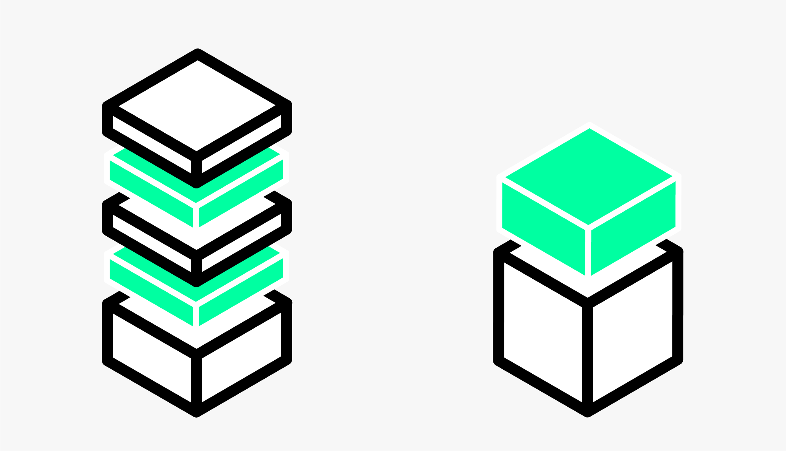
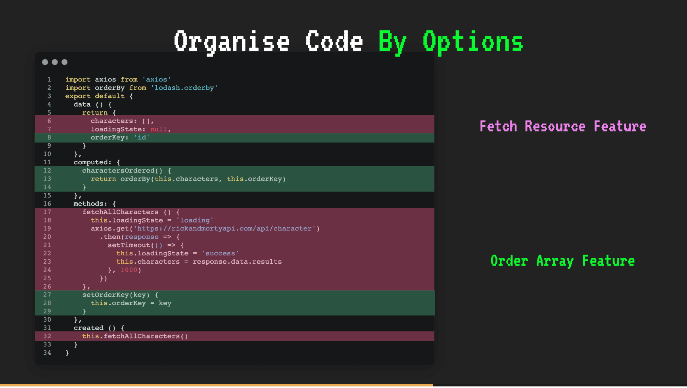
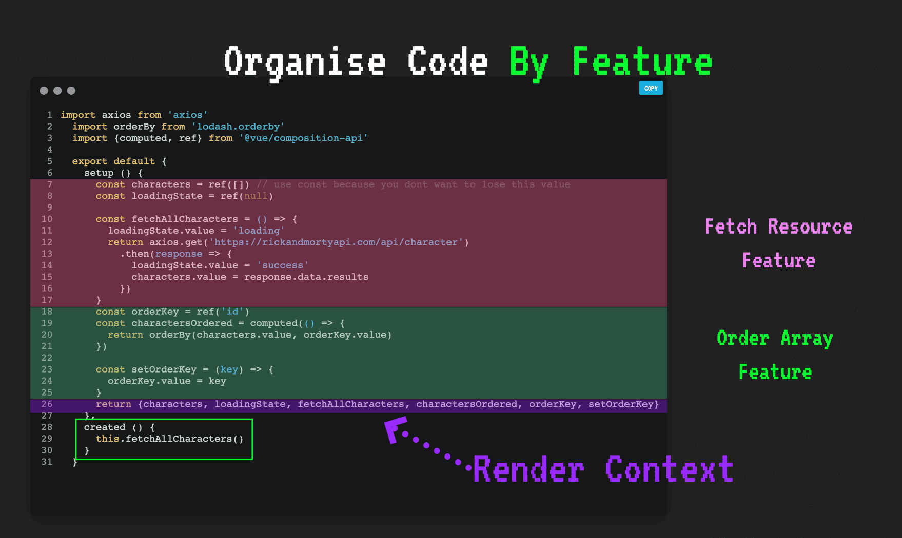

# Advanced Composition API

<br>
<small>by Peter Cosemans</small>

<small>
Copyright (c) 2017 - 2021 Euricom nv.
</small>

---

# Why

> Cleaner and more maintainable code

===



===



---

# Ref vs Reactive

> Two ways to create reactive state

===

## ref

We can make any variable reactive:

<div id="left">

```js
import { ref, onMounted } from 'vue';

export default {
  setup() {
    // Wraps primitives in an object to track changes
    const count = ref(0);

    // add methods
    const increaseCount = () => {
      count.value++;
    };

    // render context
    return { count, increaseCount };
  },
};
```

</div>

<div id="right">

<!-- prettier-ignore -->
```html
<template>
  <button @click="increaseCount">
    count is: {{ count }}
  </button>
</template>
```

</div>

===

## reactive

Creating a reactive object

<div id="left">

```js
import { reactive } from 'vue';

export default {
  setup() {
    const state = reactive({
      count: 0,
      message: 'hello world',
    });

    const increaseCount = () => {
      state.count++;
    };

    // render context
    return { state, increaseCount };
  },
};
```

</div>

<div id="right">

<!-- prettier-ignore -->
```html
<template>
  <button @click="increaseCount">
    count is: {{ state.count }}
  </button>
</template>
```

</div>

===

## Be aware of destructuring

If you try to spread the values of the object, <br/>
they will no longer be reactive

<div id="left">

```js
import { toRefs, reactive } from 'vue';

export default {
  setup() {
    const state = reactive({
      count: 0,
      message: 'hello world',
    });

    const increaseCount = () => {
      // DON'T
      const { count } = state;
      count++;

      // DO
      state.count++;
    };

    // if you want to spread, use toRefs
    return { ...toRefs(state), increaseCount };
  },
};
```

</div>

<div id="right">

<!-- prettier-ignore -->
```html
<template>
  <button @click="increaseCount">
    count is: {{ count }}
  </button>
</template>
```

</div>

===

## Props is also reactive object

```js
setup(props) {
  // DON'T
  const { name, age } = props;

  // DO
  const { name, age } = toRefs(props);
  const handler = () => {
    state.value += props.age;
  }
  return { state }
}
```

---

# Suspense

> Suspense your rendering until you are ready

===

# Async setup

A setup can be async, but you need an suspense boundary to display the component.

```js
// MyComponent.vue
await setup() {
  const users = ref([]);
  const res = await axios.get('./user.json');
  users.value = res.data;
  return { users }
}
```

```html
<!-- App.vue -->
<template>
  <suspense>
    <my-component>
  </suspense>
</template>
```

===

# Fallback

```html
<!-- App.vue -->
<template>
  <suspense>
    <template #default>
      <my-component>
    </template>
    <template #fallback>
      <div>Loading ...</div>
    </template>
  </suspense>
</template>
```

---

# Extract and Reuse Logic

> Hip, hip, hoera

===

## A typical axios handling

```js
setup() {
  const articles = ref<Article[]>([]);
  const loading = ref(false);
  const error = ref<Error>();

  onMounted(async () => {
    loading.value = true;
    try {
      const res = await axios.get('./articles');
      articles.value = res.data.items;
    }
    catch(err) {
      error.value = err;
    }
    finally {
      loading.value = false;
    }
  });

  return {
    articles, loading, error
  };
}
```

===

## Extracting Logic

```js
const useArticles = () => {
  const articles = ref<Article[]>([]);
  const loading = ref(false);
  const error = ref<Error>();

  onMounted(async () => {
    loading.value = true;
    try {
      const res = await axios.get('articles');
      articles.value = res.data.items;
    }
    catch(err) {
      error.value = err;
    }
    finally {
      loading.value = false;
    }
  });

  return {
    articles, loading, error
  };
};
```

===

## Using the abstraction

<!-- prettier-ignore -->
```js
export default {
  setup() {
    const { articles, loading } = useArticles();

    return {
      articles,
      loading
    };
  },
};
```

Looks like React hooks, huum (aka composable)

===

### useQuery

<div id="left">

```ts
// useQuery.ts
import { ref } from 'vue';
import axios from 'axios';

export const useQuery = <TResult>(url, config = {}) => {
  const data = ref<TResult>();
  const error = ref<Error>();
  const loading = ref(false);
  const fetch = async () => {
    loading.value = true;
    try {
      const res = await axios.get(url, config);
      data.value = res.data;
    } catch (error) {
      error.value = error;
    } finally {
      loading.value = false;
    }
  };
  !config.skip && fetch();
  return { data, error, loading, fetch };
};
```

</div>

<div id="left">

```html
<!-- MyComponent.vue -->
<template>
  <span v-if="loading">Loading...</span>
  <pre v-else>{{ data }}</pre>
</template>

<script>
  import { useQuery } from './hooks/useQuery';

  export default {
    setup() {
      const { data, loading } = useQuery('users.json');
      //
      // other code
      //
      return { data, loading };
    },
  };
</script>
```

</div>

===

### useArticles simplified

<!-- prettier-ignore -->
```ts
import { useQuery } from './hooks/useQuery';

interface Article {
  name: string;
  description: string;
  date: Date;
}

const useArticles = () => {
  const { data = [], loading, error } = useQuery<Article[]>('articles');
  return {
    articles: data,
    loading,
    error,
  };
};
```

===

## useMousePosition

```ts
import { ref, onMounted, onUnmounted } from 'vue';

export function useMousePosition() {
  const x = ref(0);
  const y = ref(0);

  function update(e) {
    x.value = e.pageX;
    y.value = e.pageY;
  }

  onMounted(() => {
    window.addEventListener('mousemove', update);
  });

  onUnmounted(() => {
    window.removeEventListener('mousemove', update);
  });

  return { x, y };
}
```

See more: https://vueuse.org/

---

## Exercise

> Refactor the vue-product-list

===

<!-- .slide: class="code-large" -->

## Extract load products in custom hook

<!-- prettier-ignore -->
```js
setup() {
  const { products, loadMore, hasNextPage } = useQueryProducts();

  return { 
    products
  }
}
```

===

<!-- .slide: class="code-large" -->

## Extract the infinite scroll behavior in custom hook

<!-- prettier-ignore -->
```js
const { users, loadMore, hasNextPage } = useQueryUsers();
useInfiniteScroll({
  enabled: hasNextPage,
  onLoadMore: loadMore,
});
```

---

# Options vs Composition

> The same but different (and better)

===

## Methods

<div id="left">

```js [8-12]
export default {
  data() {
    return {
      count: 0,
    };
  },

  methods {
    increaseCount() {
      this.count += 1;
    };
  }
};
```

</div>

<div id="right">

```js [7-11]
import { ref, onMounted, watch } from 'vue';

export default {
  setup() {
    const count = ref(0);

    const increaseCount = () => {
      count.value += 1;
    };

    return { count, increaseCount };
  },
};
```

</div>

===

## Computed

<div id="left">

```js [8-12]
export default {
  data() {
    return {
      result: [],
    };
  },

  computed() {
    resultCount() {
      return this.result.length;
    }
  },
};
```

</div>

<div id="right">

```js [7-11]
import { ref, computed } from 'vue';

export default {
  setup() {
    const result = ref([]);

    const resultCount = computed(() => {
      return result.value.length;
    });

    return { result, resultCount };
  },
};
```

</div>

===

## Lifecycle events

<div id="left">

```js [8-11]
export default {
  data() {
    return {
      result: [],
    };
  },

  mounted() {
    const res = await axios.get('users.json');
    this.result = res.data;
  },
};
```

</div>

<div id="right">

```js [7-11]
import { ref, onMounted, watch } from 'vue';

export default {
  setup() {
    const result = ref([]);

    onMounted(async () => {
      const res = await axios.get('users.json');
      result.value = res.data;
    });

    return { result };
  },
};
```

</div>

===

## watchers

<div id="left">

```js [8-12]
export default {
  data() {
    return {
      result: [],
    };
  },

  watchers: {
    result(newValue, oldValue) {
      console.log('Result: ' + result.value);
    },
  },
};
```

</div>

<div id="right">

```js [7-10]
import { ref, onMounted, watch } from 'vue';

export default {
  setup() {
    const result = ref([]);

    watch(result, (newValue, oldValue) => {
      console.log('Result: ' + result.value);
    });

    return { result };
  },
};
```

</div>

---

## Resources

- https://sdust.dev/content-posts-2019-12-02-vue-3-and-composition-api/
- https://www.danvega.dev/blog/2020/02/12/vue3-ref-vs-reactive/
- https://learnvue.co/2020/12/how-to-use-lifecycle-hooks-in-vue3/
- https://github.com/jsbroks/vuehooks
- https://vueuse.org/
- https://vue-query.vercel.app/#/
- https://www.vuemastery.com/pdf/Vue-3-Cheat-Sheet.pdf
