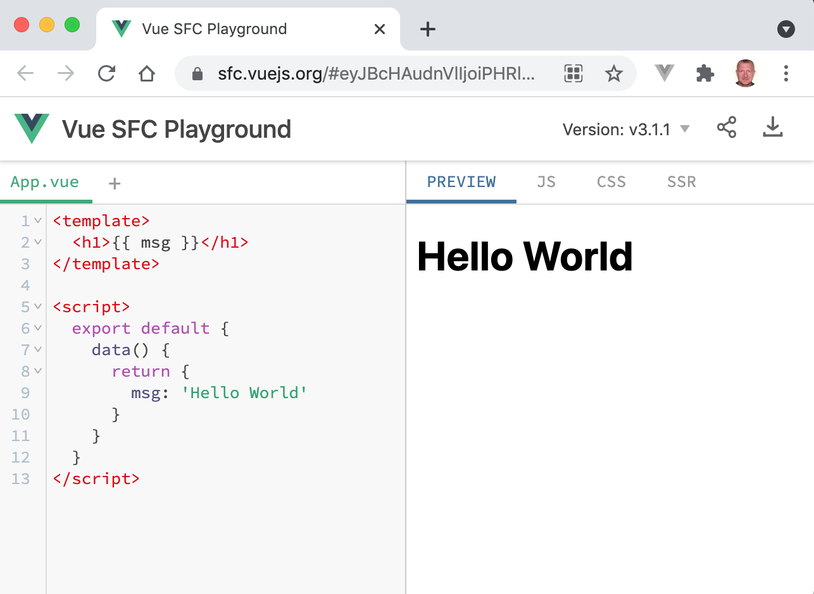
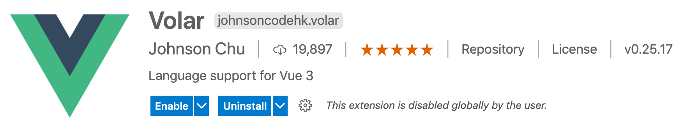
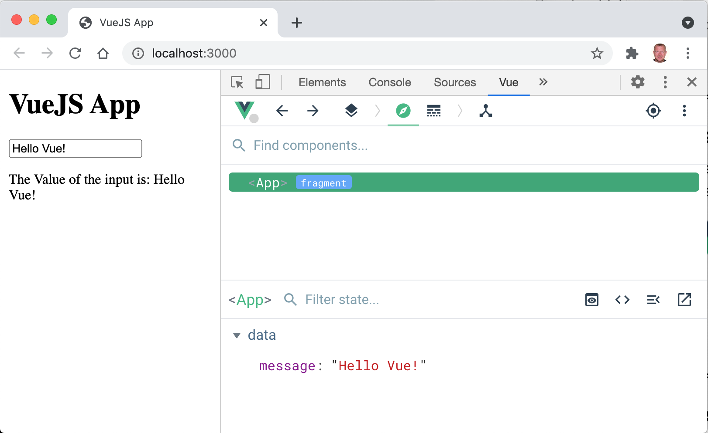
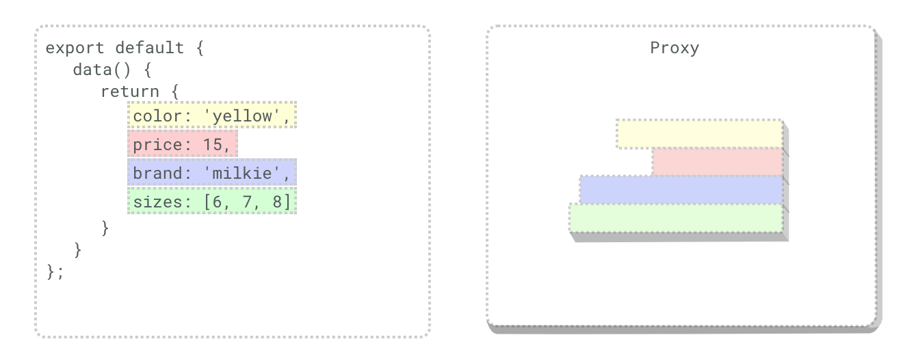
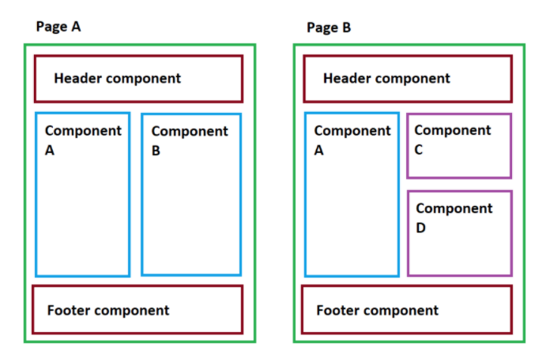
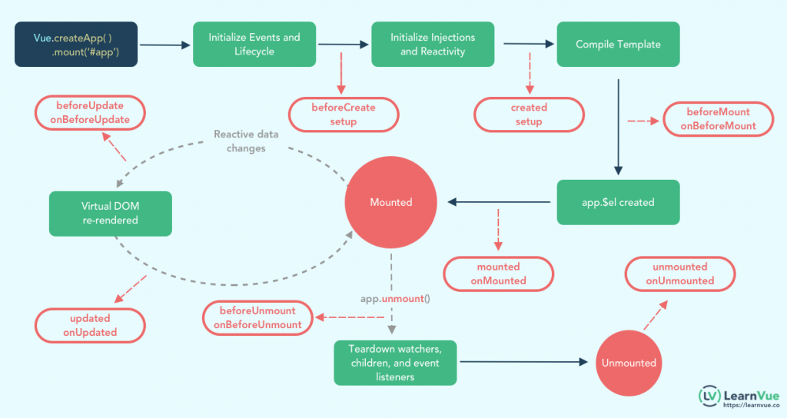

## VueJS Fundamentals

<br>
<small>by Peter Cosemans</small>

<small>
Copyright (c) 2017 - 2021 Euricom nv.
</small>

---

# Why Vue.js

- Easy to learn (The Progressive JavaScript Framework)
- Feels simple, yet powerful
- Collection of the best
- Blazing Fast Virtual DOM
- It's small (20KB min+gzip)

===

# Compare to

- A virtual DOM (React)
- Prop and centralized state management
  - Similar React
- Conditional rendering and services,
  - Similar to Angular
- Inspired by Polymer
- Offer similar development style as : html, CSS and JS

---

# Quick Start

> Easy does it.

===

## The index.html

<!-- .slide: class="code-large" -->

```html
<html lang="en">
  <body>
    <div id="app">
      <input type="text" id="input" />
    </div>
    <script>
      let data = { message: 'Hello World' };
      document.querySelector('#input').value = data.message;
    </script>
  </body>
</html>
```

Launch your webpage

```bash
$ serve .
Serving "/Users/me/git/vue" at http://127.0.0.1:8080
GET /favicon.ico 404 2.100 ms - 24
```

===

## Add VueJS

<!-- .slide: class="code-large" -->

```html
<script src="https://unpkg.com/vue@3"></script>
```

Replace the script

```html
<script>
  const App = {
    data() {
      return {
        message: 'Hello Vue!',
      };
    },
  };

  // VueJS entry point
  Vue.createApp(App).mount('#app');
</script>
```

===

## Add Vue Template

<!-- .slide: class="code-xlarge" -->

```html
<div id="app">
  <!-- vue template -->
  <input type="text" v-model="message" />
  <p>The Value of the input is: {{message}}</p>
  <!-- end of vue template -->
</div>
```

===

# Thats all folks 😀

---

# Lets get real

> Make it a real app

===

## Documentation

[https://vuejs.org/](https://vuejs.org/)

Make sure you have the correct version

- [https://v1.vuejs.org/guide](https://v1.vuejs.org/guide/)
- [https://vuejs.org/v2/guide](https://vuejs.org/v2/guide/)
- [https://v3.vuejs.org/guide](https://v3.vuejs.org/guide/)

Training

- [https://www.vuemastery.com/](https://www.vuemastery.com/)

===

<!-- .slide: class="code-large" -->

## The .vue file

```html
<!-- App.vue -->
<template>
  <input type="text" id="input" v-model="message" />
  <p>The Value of the input is: {{message}}</p>
</template>

<script>
  export default {
    data() {
      return {
        message: 'Hello Vue!',
      };
    },
  };
</script>

<style>
  body {
    margin: 10px;
  }
</style>
```

Combines template, javascript & styling

===

## Import the .vue file

<!-- .slide: class="code-xlarge" -->

```ts
// main.ts
import { createApp } from 'vue';
import App from './App.vue';

createApp(App).mount('#app');
```

===

## Quick start Vue CLI

<!-- .slide: class="code-xlarge" -->

```bash
#install vue CLI
npm install -g @vue/cli
```

```bash
# create basic vue app
vue create hello-vue
```

===

## Vue Playground

Good for demo and quick check



[https://sfc.vuejs.org](https://sfc.vuejs.org/#eyJBcHAudnVlIjoiPHRlbXBsYXRlPlxuICA8aDE+e3sgbXNnIH19PC9oMT5cbjwvdGVtcGxhdGU+XG5cbjxzY3JpcHQ+XG4gIGV4cG9ydCBkZWZhdWx0IHtcbiAgICBkYXRhKCkge1xuICAgICAgcmV0dXJuIHtcblx0XHRcdFx0bXNnOiAnSGVsbG8gV29ybGQnXG4gICAgICB9XG5cdFx0fVxuICB9XG48L3NjcmlwdD4ifQ==)

===

## Quick start with vue starter

<!-- .slide: class="code-xlarge" -->

Includes:

- Vite as dev environment
- Typescript support
- Hot module reload
- Prettier
- ESLint with airbnb config

===

## Install Volar extension

Volar: Fast Vue Language Support Extension



- Color syntax highlighting
- Typescript support
- Etc ...

===

## Devtools



[Vue.js devtools](https://chrome.google.com/webstore/detail/vuejs-devtools/ljjemllljcmogpfapbkkighbhhppjdbg)

---

# VueJS - Binding

> Connect your model to the view

===

## Value Binding

<!-- .slide: class="code-large" -->

```js
data() {
  return {
    message: 'Hello from VueJS'
  }
}
```

Simple binding (mustaches)

```html
<p>
  The Value of the input is:
  <span>{{message}}</span>
</p>
```

`v-text` directive

```html
<p>
  The Value of the input is:
  <span v-text="message"></span>
</p>
```

===

## Template Expressions

<!-- .slide: class="code-large" -->

The 'Mustaches' syntax can contain any Javascript expressions.

<!-- prettier-ignore -->
```html
<span>{{ number + 1 }}</span>

<h2>{{ ok ? 'YES' : 'NO' }}<h2>

<div class="alert">
  {{ message.split('').reverse().join('') }}
</div>
```

But template expressions are sandboxed <br>and only have access to a [whitelist of globals](https://github.com/vuejs/vue/blob/v2.6.10/src/core/instance/proxy.js#L9) such as Math and Date

===

## Attributes binding

<!-- .slide: class="code-large" -->

'Mustaches' cannot be used inside HTML attributes. <br>Instead, use a v-bind directive:

<!-- prettier-ignore-->
```html
<button v-bind:disabled="isButtonDisabled">
  Button
</button>
```

Shorthand syntax `:`

<!-- prettier-ignore-->
```html
<button :disabled="isButtonDisabled">
  Button
</button>
```

===

## Event Binding

<!-- .slide: class="code-large" -->

Used for binding to events like click, mousemove & etc...

<!-- prettier-ignore-->
```html
<button v-on:click="counter += 1">
  Inc
</button>
```

Shorthand syntax `@`

<!-- prettier-ignore-->
```html
<button @click="counter += 1">
  Inc
</button>
```

===

## Event Binding to methods

```html
<template>
  Counter: {{ counter }}
  <button @click="increment">Inc</button>
</template>
<script>
  export default {
    data() {
      return { counter: 0 };
    },
    methods: {
      increment() {
        this.counter += 1;
      },
    },
  };
</script>
```

===

## Conditional Rendering

<!-- .slide: class="code-large" -->

`v-if` and `v-else` directive

```html
<div v-if="Math.random() > 0.5">Now you see me</div>
<div v-else>Now you don't</div>
```

`v-show` directive

```html
<h1 v-show="ok">Hello!</h1>
```

`v-show` is using CSS to show/hide content, <br>`v-if` removes the content from the dom.

---

# Exercise

Use a button to toggle (hide/show) a paragraph of text

- Look for multiple solutions

---

# Reactivity

> React to changes

===

## The proxy

```js
const diner = {
  meal: 'burger',
};
const handler = {
  get(target, prop) {
    console.log('intercepted get');
    return target[prop];
  },
  set(target, prop) {
    console.log('intercepted set');
    return target[prop];
  },
};
const proxy = new Proxy(diner, handler);
console.log(proxy.meal);
```

===

## The proxy



When you pass an object to the Vue instance as `data`, Vue converts is to a proxy.

===

## Dump proxy

```html
<template>
  Counter: {{ counter }}
  <button @click="increment">Inc</button>
</template>
<script>
  export default {
    data() {
      return { counter: 0 };
    },
    methods: {
      increment() {
        console.log(this); // log proxy to console
        this.counter += 1;
      },
    },
  };
</script>
```

---

# Directives

> Extend the behavior of existing elements

===

## What's a directive

<!-- .slide: class="code-large" -->

A directive is some special token in the markup<br> that tells the library to do something to a DOM element.

```html
<div v-text="message"></div>
```

Some directives can take an “argument”, <br>denoted by a colon after the directive name

<!-- prettier-ignore-->
```html
<a v-bind:href="url"> ... </a>
<a v-on:click="doSomething"> ... </a>
```

> Directives is the glue of VueJS templates

===

### v-text

<!-- .slide: class="code-large" -->

Updates the textContent of the element. <br>{{ message }} is a shortcut for the `v-text` directive.

<!-- prettier-ignore-->
```html
<span v-text="message"></span>
<span>{{message}}</span>
```

===

<!-- .slide: class="code-large" -->

### v-text

Can use string, number, boolean, object & array.

```js
data() {
  return {
    counter: 1,
    user: { name: 'Peter', id: '123456' }
    hasAccess: false
  }
}
```

```html
<div>{{ counter }}</div>
<div>{{ hasAccess }}</div>
<code>
  <pre>
    {{ user }}
  </pre>
</code>
```

===

<!-- .slide: class="code-large" -->

### v-bind

Dynamically bind one or more attributes, <br>or a component prop to an expression.

```html
 <br />
 <br />
<div :class="{ red: isRed }"></div>
```

===

### v-on

Bind to an event

<!-- prettier-ignore-->
```html
<button v-on:click="counter += 1"></button>
<button @click="counter += 1"></button>
```

Bind an event to a method

<div id="left">

```js
{
  data() {
    message: 'hello'
  },
  methods: {
    handleClick(event) {
      console.log('clicked', event)
    }
    handleOtherClick(arg, event) {
      console.log('clicked', arg, event)
    }
  }
}
```

</div>

<div id="right">

<!-- prettier-ignore-->
```html
<button @click="handleClick">
  Click me
</button>

<button @click="handleOtherClick(123, $event)">
  Click me
</button>
```

</div>

===

### v-on

<!-- .slide: class="code-large" -->

event.preventDefault

```html
<form @submit="submit($event)">
  <input type="text" v-model="name" />
</form>
```

```js
{
  data() {
    name: ''
  },
  methods: {
    submit(event) {
      event.preventDefault();
      console.log('submit');
    }
  }
}
```

===

### v-on modifiers

| modifier        | description                                                |
| --------------- | ---------------------------------------------------------- |
| @submit.prevent | call event.preventDefault()                                |
| @mousemove.stop | call event.stopPropagation()                               |
| @keyup.112      | only react on keyCode (deprecated in v3)                   |
| @keyup.enter    | only react on 'enter' key                                  |
| ...             | see [doc's](https://v3.vuejs.org/api/directives.html#v-on) |

===

### v-view, v-hide

<!-- .slide: class="code-large" -->

Are conditionals that will hide/display information (html elements).<br>
`v-show` toggles the display CSS property of the element.

<!-- prettier-ignore -->
```html
<span v-show="toggle">Just some text </span>

<span v-hide="!error">Error: {{error.message}}</span>
```

===

### v-if, v-else

<!-- .slide: class="code-large" -->

Is a conditional that will render/not render information.

<!-- prettier-ignore -->
```html
<span v-if="toggle">Just some text </span>
<span v-else>Other text</span>
```

Conditional group

```html
<template v-if="ok">
  <h1>Title</h1>
  <p>Paragraph 1</p>
  <p>Paragraph 2</p>
</template>
```

See also `v-elseif`

===

## v-for

Render the template block multiple times

```js
data() {
    return {
        users: [
          {id: 1, name: 'Joe'}
          {id: 2, name: 'Mary'}
          {id: 3  name: 'Jane'}
        ],
    }
},
```

```html
<div id="root">
  ...
  <ul>
    <li v-for="user in users" :key="user.id">{{user.name}}</li>
  </ul>
</div>
```

===

### v-model

<!-- .slide: class="code-large" -->

Relation between model and form input

```js
data() {
  return {
    message: 'Hello World'
    toggle: false
  }
}
```

```html
<input type="text" v-model="message" /> <br />
<input type="checkbox" v-model="toggle" /> <br />
Message: {{ message }} - {{ toggle }}
```

This is real 2 way binding on every [input event](https://developer.mozilla.org/en-US/docs/Web/API/HTMLElement/input_event)

===

### v-model - modifiers

| modifier       | description                          |
| -------------- | ------------------------------------ |
| v-model.trim   | strip leading or trailing whitespace |
| v-model.number | change string to number              |
| v-model.lazy   | model is updated after change events |

===

## v-html

<!-- .slide: class="code-large" -->

The double mustaches interprets the data as plain text, not HTML.

```js
data() {
  return {
    rawHtml: '<strong>Info</strong><br/>Error Message'
  }
}
```

```html
<p>Using mustaches: {{ rawHtml }}</p>
<p>Using v-html directive: <span v-html="rawHtml"></span></p>
```

Dynamically rendering arbitrary HTML on your website can be very dangerous because it can easily lead to [XSS vulnerabilities](https://en.wikipedia.org/wiki/Cross-site_scripting). Only use HTML interpolation on trusted content and never on user-provided content.

===

### Directives Overview

| Directive | Description                               | Sample                                  |
| --------- | ----------------------------------------- | --------------------------------------- |
| v-text    | Updates the element's textContent         | `<span v-text="msg" />`                 |
| v-bind    | Dynamically bind one or more attributes   | ``         |
| v-on      | Attaches an event listener to the element | `<button v-on:click="doThis"></button>` |
| v-if      | Conditionally render the element          | `<span v-if="test">Show Me</span>`      |
| v-show    | Conditionally render the element          | `<span v-show="test">Show Me</span>`    |

===

### Directives Overview

| Directive | Description                                      | Sample                                           |
| --------- | ------------------------------------------------ | ------------------------------------------------ |
| v-for     | Render the template block multiple times         | `<div v-for="item in items">{{item.text }}<div>` |
| v-model   | Create a two-way binding on a form input element | `<input type="text" v-model="user" />`           |
| v-html    | Updates the element's innerHTML                  | `<div v-html="html"></div>`                      |

---

# Methods

> Where to put those handlers?

===

## Methods

Functions performing state (data) updates. <br>Can be accessed in the template.

<div id="left">

```js
const App = {
  data() {
    return {
      counter: 0,
    };
  },
  methods: {
    increment(event) {
      console.log(event)
      this.counter++;
    }
    decrement() {
      console.log(event)
      this.counter--;
    }
  }
};
```

</div>

<div id="right">

<!-- prettier-ignore -->
```html
<div>
  <button @click="increment">
    +
  </button>
  <span>{{ counter }}</span>
  <button @click="decrement">
    -
  </button>
</div>
```

</div>

Notice we are using the `this` reference to access the state

===

## Methods - arguments

<div id="left">

<!-- prettier-ignore -->
```html
<div>
  <button @click="increment(10, $event)">
    +
  </button>
  <span>{{ counter }}</span>
  <button @click="decrement(10)">
    -
  </button>
</div>
```

</div>

<div id="right">

```js
increment(offset, event) {
  console.log(offset, event);
  this.counter += offset;
}

decrement(offset) {
  console.log(offset);
  this.counter -= offset;
}

```

</div>

---

# Composition API

> Cleaner and more maintainable code

New in VueJS 3.0

===

## Option API vs Composition API

<div id="left">

```html
<!-- OptionAPI -->
<template>
  {{ name }}
  <button @click="handleClick()">
</template>

<script>
  export default {
    data() {
      return { name: 'max' };
    }
    methods: {
      handleClick() {
        this.name = 'peter'
      }
    }
  }
</script>
```

</div>

<div id="right">

```html
<!-- Composition API -->
<template>
  {{ name }}
  <button @click="handleClick()">
</template>

<script>
  import { ref } from 'vue';
  export default {
    setup() {
      const name = ref('max');
      const handleClick = () => {
        name.value = 'peter';
      }
      // expose to template
      return { name, handleClick }
    }
  }
</script>
```

</div>

No more this reference :)

===

## data vs ref

<div id="left">

```js
data() {
  return {
    counter: 0,
    message: 'Hello',
    name: undefined,
  }
}
```

</div>

<div id="right">

```js
setup() {
  const counter = ref(0);
  const message = ref('Hello');
  const name = ref();
}
```

</div>

===

## methods vs handlers

<div id="left">

```js
data() {
  return {
    counter: 0,
  }
}
methods() {
  handleClick(event, arg) {
    console.log(event)
    this.counter += arg;
  }
}
```

</div>

<div id="right">

```js
setup() {
  const counter = ref(0);

  const handleClick = (event, arg) => {
    console.log(event)
    counter.value += arg;
  }

  return {
    counter,
    handleClick
  }
}
```

</div>

===

## Setup Script

<div id="left">

```html
<!-- Composition API -->
<template>
  {{ name }}
  <button @click="handleClick()">
</template>

<script>
  import { ref } from 'vue';
  export default {
    setup() {
      const name = ref('max');
      const handleClick() {
        name.value = 'peter'
      }
      // expose to template
      return { name, handleClick }
    }
  }
</script>
```

</div>

<div id="right">

```html
<!-- Setup Script -->
<template>
  {{ name }}
  <button @click="handleClick()">
</template>

<script setup>
  import { ref } from 'vue';
  const name = ref('max');
  const handleClick() {
    name.value = 'peter'
  }
</script>
```

</div>

New from VueJS 3.2

---

# Computed properties

> Runtime calculations

===

## Computed properties

Are calculation based on the state. We also call this the derived state.
Computed properties are cached and will only update when state changes.

<div id="left">

```js
import { ref, computed } from 'vue';

export default {
  setup() {
    const users = ref(['peter', 'john', 'jan', 'pieter']);
    const filter = ref('');

    const filteredUsers = computed(() => {
      return users.value.filter((item) => {
        return item.startsWith(filter.value);
      });
    });
  },
};
```

</div>

<div id="left">

<!-- prettier-ignore -->
```html
<ul>
  <li v-for="user in filteredUsers">
    {{ user }}
  </li>
</ul>
<input type="text" v-model="filter" />
```

</div>

===

## Computed properties vs methods

| Computed                              | Methods                      |
| ------------------------------------- | ---------------------------- |
| Runs only when the dependency changes | Runs on action               |
| Cached                                | Not Cached                   |
| Should be used as property            | Typically invoked from event |
| Returns derived state                 | Typically updates state      |

---

# Watchers

> Watch data changes

===

## Watchers

Gets called when data changes.

```js
import { ref, watch } from 'vue';
export default {
  setup() {
    const counter = ref(0);
    const increment = () => {
      counter.value += 1;
    };

    watch(counter, (newValue, oldValue) => {
      console.log(newValue, oldValue);
    });
  },
};
```

---

# Filters

> Format your data

===

## Filters

<!-- .slide: class="code-large" -->

```html
{{ message | toUpperCase }}

<div v-text="date | formatDate"></div>
```

===

## But

- VueJS 1.0: Had predefined filters.

- VueJS 2.0: No predefined filters but you can create them.

- VueJS 3.0: Filters are removed and no longer supported.

<div id="left">

```html
<!-- Vue v2 -->

{{ message | toUpperCase }}

<div v-text="date | formatDate" />
```

</div>
<div id="right">

```html
<!-- Vue v3 -->

{{ message.toUpperCase() }}

<div v-text="formatDate(date)" />
```

</div>

End of story 🙏

---

# Styling

> Make it pretty

===

## Global styling

Import you global style in JS

```js
// main.ts
import { createApp } from 'vue';
import App from './App';

// load external css
import '../node_modules/bootstrap/dist/css/bootstrap.css';

// this works in webpack
// import '~/bootstrap/dist/css/bootstrap.css

// load app styling
import './global.css';
// or import './global.scss';
// or import './global.less';
// or import './global.stylus';

createApp(App).mount('#app');
```

===

## Local CSS

<!-- .slide: class="code-large" -->

Place you css in the `style` tag

```html
<!-- App.vue -->
<style>
  .classroom {
    background: #232323;
  }
</style>
```

You can specify the style language (less, sass, stylus)

```html
<style lang="scss">
  $bg-classroom: #232323;
  .classroom {
    background: $bg-classroom;
  }
</style>
```

===

<!-- .slide: class="code-large" -->

## Object Syntax

We can pass an object to `:class` to dynamically toggle classes:

<!-- prettier-ignore -->
```html
<span class="static" 
     :class="{ active: isActive, 'text-danger': hasError }">
  Item
</span>
```

```js
setup() {
  const isActive = ref(true);
  const hasError = ref(false);
  return { isActive, hasError };
}
```

Will render as

```html
<span class="static active">Item</span>
```

===

<!-- .slide: class="code-large" -->

## Array Syntax

We can pass an array to `:class` to apply a list of classes:

```html
<div :class="[activeClass, errorClass]"></div>
```

```js
setup() {
  const activeClass = ref('active');
  const errorClass = ref('text-danger');
  return { activeClass, errorClass }
}
```

Will render as:

```html
<div class="active text-danger"></div>
```

---

# Exercise

Create a small TODO list

- Show list of tasks
- Text `input` to enter a task
- Press `enter` key to add the task
- Add buttons (per task) to remove task
- Show the total count of tasks
- Apply some style

---

# Components

> The power of VueJS

===

## What are components

Re-usable UI components: like extending your html

<!-- prettier-ignore -->
```html
<div>
  <Header />
  <UserList :user="user" @click="handleClick" />
  <Footer />
</div>
```



===

## .vue file === component

Every .vue file is a component. The App itself is a component.

<div id="left">

```html
<!-- App.vue -->
<script>
  import HelloWorld from './HelloWorld.vue';

  export default {
    name: 'App',
    components: {
      HelloWorld,
    },
  };
</script>
```

</div>

<div id="right">

```html
<!-- HelloWorld.vue -->
<template><h1>Hello World</h1></template>
<script>
  export default {
    setup() {
      // ...
    },
  };
</script>
```

</div>

===

## Props

Passing data to child components with Props

```html
<script>
  export default {
    props: {
      msg: String,
      counter: Number,
      isActive: Boolean,
    },
    setup(props) {
      // use the props
    },
  };
</script>
```

```html
<!-- static prop -->
<HelloWorld msg="welcome to vue components" />

<!-- dynamic props -->
<HelloWorld :msg="Hello ${userName}" :counter="12" is-active />
```

===

## Props - Validation

It's always good to add additional props validation

```js
export default {
  props: {
    // Basic type check
    propA: Number,
    // Multiple possible types
    propB: [String, Number],
    // Required string
    propC: {
      type: String,
      required: true,
    },
    // Number with a default value
    propD: {
      type: Number,
      default: 100,
    },
  },
};
```

===

## Passing props to template

```html
<template>
  <div>{{props.name}}</div>
</template>
<script>
  import { PropType } from 'vue';
  export default {
    name: 'MyComponent',
    props: {
      name: {
        type: String,
        required: true,
      },
    },
    setup(props) {
      // pass all props to template
      return { props };
    },
  };
</script>
```

===

## Props are readonly

<!-- .slide: class="code-large" -->

You can't change a prop

```js
{
  props: [{ initialValue: String}],
  setup(props) {
    // create a ref based on the prop
    const value = ref(props.initialValue)
  }
}
```

Use the prop as initial data value.

===

## Events

<!-- .slide: class="code-large" -->

You can emit an event from the child component to the parent.

```js
{
  name: 'HalloWorld',
  emits: ['selected'],
  setup(props, context) {
    const handleClick = () => {
      context.emit('selected')
    }
    return { handleClick }
  }
}
```

```html
<HelloWorld @selected="handleSelect"></HelloWorld>
```

===

## Events - passing arguments

<!-- .slide: class="code-large" -->

```js
// in child component
context.emit('selected', item);
```

```html
<template>
  <HelloWorld @selected="handleSelect"></HelloWorld>
</template>

<script>
  export default {
    setup() {
      const handleSelect = (item) => {
        console.log(item);
      },
      return { handleSelect }
    },
  };
</script>
```

===

## Lifecycle events

Using Composition API

```js
setup() {
  // Add here the startup code

  onMounted(() => {
      // Element is created (html in doc)
  });

  onUpdated(() => {
      // Called after a data change
  });

  onUnmounted(() => {
      // Called after a Vue instance has been destroyed
  });
}
```

More: https://v3.vuejs.org/guide/composition-api-lifecycle-hooks.html

===

## Lifecycle events



===

## Lifecycle events - Vue 2 vs Vue 3

```
Vue 2             Vue 3
--------------------------
beforeCreate ->   use setup()
created ->        use setup()
beforeMount ->    onBeforeMount
mounted ->        onMounted
beforeUpdate ->   onBeforeUpdate
updated ->        onUpdated
beforeDestroy ->  onBeforeUnmount
destroyed ->      onUnmounted
errorCaptured ->  onErrorCaptured
```

===

## Slots

<!-- .slide: class="code-large" -->

Using the <slot> to pass the inner content from the parent to the child

```html
<styled-button><strong>Add todo</strong></styled-button>
```

```html
<!-- styledButton.vue -->
<template>
  <button class="btn-primary">
    <slot></slot>
  </button>
</template>
```

```html
<!-- rendered HTML -->
<button class="btn-primary">
  <strong>Add todo</strong>
</button>
```

===

## Named Slots

```html
<!-- MyComponent.vue -->
<template>
  <div class="container">
    <header>
      <slot name="header"></slot>
    </header>
    <main>
      <slot>Default content</slot>
    </main>
    <footer>
      <slot name="footer"></slot>
    </footer>
  </div>
</template>
```

Specify the name of the slot

```html
<my-component>
  <h1 v-slot:header>Page title</h1>
  <p>the main content.</p>
  <p v-slot:footer">Contact info</p>
</my-component>
```

===

## Slots - default content

<!-- .slide: class="code-large" -->

```html
<!-- styledButton.vue -->
<template>
  <button class="btn-primary">
    <slot>button</slot>
  </button>
</template>
```

```html
<!-- template -->
<styled-button></styled-button>
```

```html
<!-- will be rendered as -->
<button class="btn-primary">button</button>
```

Usefull to have a fallback rendering.

===

## Scoped CSS

<!-- .slide: class="code-large" -->

When a 'style' tag has the scoped attribute, <br> its CSS will apply to elements of the current component only.

```html
<template>
  <button>Click Me</button>
</template>

<style scoped>
  button {
    background-color: red;
  }
</style>
```

It's a good practice to always use scoped CSS.

---

# Exercise

Create dismissible bootstrap alert component

- Use bootstrap styling:<br/>
  http://getbootstrap.com/components/#alerts-dismissible
- Create VueJS component

<!-- prettier-ignore -->
```html
<!-- default alert: warning -->
<Alert> Almost out of stock </Alert>

<!-- custom alert with event -->
<Alert type="alert" @closed="handleClosed" closable> 
  <strong>Alert!</strong> We have a problem.
</Alert>
```

- Don't use jquery or the bootstrap js library
- Log a message to the console if the dialog is closed

---

# Data Access

> Connect to the API

===

## Using Axios

```html
<template>
  <ul>
    <li v-for="user of users">{{user.name}}</li>
  </ul>
</template>
<script>
  import axios from 'axios';
  import { ref, onMounted } from 'vue';
  export default {
    setup() {
      const users = ref([]);

      onMounted(async () => {
        const res = await axios.get('./users.json');
        users.value = res.data;
      }

      return { users }
    }
  }
</script>
```

===

## Using Fetch

```html
<template>
  <ul>
    <li v-for="user of users">{{user.name}}</li>
  </ul>
</template>
<script>
  import { ref, onMounted } from 'vue';

  export default {
    setup() {
      const users = ref([]);
      onMounted(() => {
        fetch('./users.json')
          .then((res) => res.json())
          .then((users) => {
            users.value = users;
          });
      });
      return { users };
    },
  };
</script>
```

===

## Using Fetch

Improved

```js
function checkStatus(res) {
  if (!res.ok) throw Error(res.statusText);
  return res;
}
fetch('./users.json')
  .then(checkStatus)
  .then((res) => res.json())
  .then((users) => {
    users.value = users;
  });
  .catch(err => {
    console.log('error', err);
  })
```

---

# Exercise

> Build an app to show a list of products

- Use `https://euricom-test-api.herokuapp.com` to get a list of products
- Use `fetch` api or `axios` to access data
- Use bootstrap for styling
- Show image, title, sku and price in table format.
- Optional
  - Provide load more, paging or infinite scrolling
  - Make the headers clickable to sort rows

---

# What's next

- [Vue-router](https://router.vuejs.org/)
- TypeScript
- Global State Management ([Vuex](https://vuex.vuejs.org/), [Context Providers](https://markus.oberlehner.net/blog/context-and-provider-pattern-with-the-vue-3-composition-api/))
- Advanced forms ([vee-validate](https://vee-validate.logaretm.com/v4/) & [Yup](https://github.com/jquense/yup))
- [Vue.js Component Style Guide](https://github.com/pablohpsilva/vuejs-component-style-guide#component-structure)
