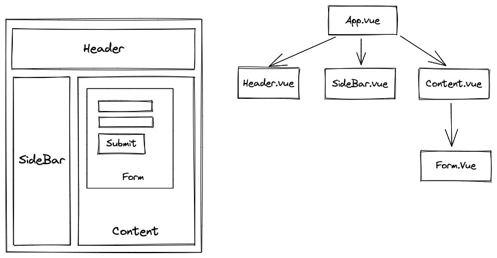

## VueJS Fundamentals

<br>

<div class="absolute bottom-10">
  <small>
  by Peter Cosemans<br />
  Copyright (c) 2017-2022 Euricom nv.
  </small>
</div>

---
layout: section-dark
background: /calm7.jpeg
---

# The Progressive JavaScript Framework

An approachable, performant and versatile framework for building web user interfaces.

---

# Why Vue.js

- Easy to learn 
- Feels simple, yet powerful
- Collection of the best
- Blazing Fast Virtual DOM
- It's small (20KB min+gzip)

---

# Compare to

- A virtual DOM (React)
- Prop and centralized state management
  - Similar React
- Conditional rendering and services,
  - Similar to Angular
- Inspired by Polymer
- Offer similar development style as : html, CSS and JS

---

# Documentation

[https://vuejs.org/](https://vuejs.org/)

Make sure you have the correct version

- [Vue 2 documentation](https://v2.vuejs.org/guide)
- [Vue 3 documentation](https://vuejs.org/guide)

Training

- [https://www.vuemastery.com/](https://www.vuemastery.com/)


---
layout: section-dark
background: /calm1.jpeg
---

# Getting started

---

# Manual setup 1/4

Start new project

```bash
npm init --force
```

Install dependencies

```
npm install vue
npm install typescript vite @vitejs/plugin-vue --save-dev
```

---

# Manual setup 2/4

Create vite setup (vite.config.js)

```js
import { defineConfig } from "vite";
import Vue from "@vitejs/plugin-vue";

export default defineConfig({
  plugins: [Vue()],
});
```

index.html

```html
<!DOCTYPE html>
<html>
  <body>
    <script src="./src/main.js" type="module"></script>
  </body>
</html>
```

---

# Manual setup 3/4

Create the app

```js
import { createApp } from 'vue'
// import the root component App.
import App from './App.vue'

const app = createApp(App)
```

And mount it

```html
<body>
  <div id="app"></div>
  <script src="./src/main.js" type="module"></script>
</body>
```

```js
app.mount('#app')
```

---

# Manual setup 4/4

App.vue

```html
<script setup>
const greeting = 'Hello Vue';
</script>

<template>
  <p class="greeting">{{ greeting }}</p>
</template>
```

And start the dev server

```bash
npm run dev
```

---

# Debug tools 1/2

VSCode 'Vue Language Features (Volar)' extension


- Color syntax highlighting
- Typescript support
- Etc ...

---

# Debug tools 2/2


[Vue.js devtools](https://chrome.google.com/webstore/detail/vuejs-devtools/ljjemllljcmogpfapbkkighbhhppjdbg)

---

# Quick start with VueCLI (vue2)

```bash
# install Vue CLI
install -g @vue/cli

# create a new project
vue create hello-vue2

# open and run
cd hello-vue2
npm run serve
```

Vue CLI is more or less outdated, but it's still a good tool to get started with Vue 2.

---

# Quick start with 'create-vue'

```bash
# install and execute create-vue
npm init vue@latest
```

```bash
✔ Project name: … <your-project-name>
✔ Add TypeScript? … No / Yes
✔ Add JSX Support? … No / Yes
✔ Add Vue Router for Single Page Application development? … No / Yes
✔ Add Pinia for state management? … No / Yes
✔ Add Vitest for Unit testing? … No / Yes
✔ Add Cypress for both Unit and End-to-End testing? … No / Yes
✔ Add ESLint for code quality? … No / Yes
✔ Add Prettier for code formatting? … No / Yes

Scaffolding project in ./<your-project-name>...
Done.
```

The now, official Vue project scaffolding tool.

See docs for more info.
https://vuejs.org/guide/quick-start.html#local

---

# Quick start with 'vue-starter-kit'

```bash
./vue-starter-key/
```

Features

- ⚡️ [Vue 3](https://github.com/vuejs/core), [Vite 3](https://github.com/vitejs/vite), [pnpm](https://pnpm.io/), [ESBuild](https://github.com/evanw/esbuild) - born with fastness
- 🍍 [State Management via Pinia](https://pinia.vuejs.org/)
- 🎨 [Tailwindcss](https://tailwindcss.com/)
- 🔥 Use the [new `<script setup>` syntax](https://github.com/vuejs/rfcs/pull/227)
- 🤙🏻 [Reactivity Transform](https://vuejs.org/guide/extras/reactivity-transform.html) enabled
- 🦾 TypeScript, of course
- ⚙️ Unit Testing with [Vitest](https://github.com/vitest-dev/vitest)

---
layout: section-dark
background: /calm2.jpeg
---

# The structure of a Vue App

---

# Single-File Components (SFC)

App.vue

```html
<script setup>
const greeting = 'Hello World';
</script>

<template>
  <p class="greeting">{{ greeting }}</p>
</template>

<style>
.greeting {
  color: red;
  font-weight: bold;
}
</style>
```

---

# A composition of components



---

# A composition of components

App.vue

```html
<script setup>
import Header from './components/Header.vue'
import SideBar from './components/SideBar.vue'
import Content from './components/Content.vue'
</script>

<template>
  <div class="app">
    <Header />
    <div class="container">
      <SideBar />
      <Content />
    </div>
  </div>
</template>
```

---

# A composition of components

Header.vue

```html
<template>
  <h1>header</h1>
</template>
```

SideBar.vue

```html
<template>
  <h1>header</h1>
</template>
```

---
layout: section-dark
background: /calm3.jpeg
---

# Bindings
## Connect your model to the view

---

# Value Binding

```js
<script setup>
const message = 'Hello from VueJS'
</script>
```

Simple binding (mustaches)

```html
<p>
  The Value of the input is:
  <span>{{ message }}</span>
</p>
```

v-text directive

```html
<p>
  The Value of the input is:
  <span v-text="message"></span>
</p>
```

---

# Template Expressions

The 'Mustaches' syntax can contain any Javascript expressions.

```html
<span>{{ number + 1 }}</span>

<h2>{{ ok ? 'YES' : 'NO' }}<h2>

<div class="alert">
  {{ message.split(' ').reverse().join('.') }}
</div>
```

But template expressions are sandboxed <br>and only have access to a [whitelist of globals](https://github.com/vuejs/vue/blob/v2.6.10/src/core/instance/proxy.js#L9) such as Math and Date

---

# Attributes binding

'Mustaches' cannot be used inside HTML attributes Instead, use a v-bind directive:

```vue
<script setup>
  const isButtonDisabled = true;
</script>

<template>
  <button v-bind:disabled="isButtonDisabled">
    Button
  </button>
</template>
```

Shorthand syntax `:`

```html
<button :disabled="isButtonDisabled">
  Button
</button>
```

---

# Event Binding

Used for binding to events like click, mousemove & etc...

```vue
<template>
  <button v-on:click="handleClick">ClickMe</button>
</template>

<script setup>
  const handleClick = () => {
    console.log('clicked')
  }
</script>
```

Shorthand syntax `@`

```html
<button @click="handleClick">
  Inc
</button>
```

---
layout: section-dark
background: /calm4.jpeg
---

# Reactivity Fundamentals
## Response to changes

---

# Declaring Reactive State

```html
<script setup>
import { reactive } from 'vue';

const state = reactive({ count: 0 });
const handleClick = () => {
  state.count++;
};
</script>

<template>
  <div class="flex gap-3 m-10">
    <button class="btn" @click="handleClick">
      normal
    </button>
    counter: {{ state.count }}
  </div>
</template>
```

---

# The proxy 1/2


The returned value from reactive() is a Proxy of the original object, which is not equal to the original object

```
const raw = {}
const proxy = reactive(raw)

// proxy is NOT equal to the original.
console.log(proxy === raw) // false
```

---

# The proxy 2/2

```js
const diner = {
  meal: 'burger',
};
const handler = {
  get(target, prop) {
    console.log('intercepted get');
    return target[prop];
  },
  set(target, prop) {
    console.log('intercepted set');
    return target[prop];
  },
};
const proxy = new Proxy(diner, handler);
console.log(proxy.meal);
```

---

# Limitations of reactive()

1. It only works for object types (objects, arrays, and collection types such as Map and Set). It cannot hold primitive types such as string, number or boolean.

```js
import { ref } from 'vue'

// reactive primitive variable
const count = ref(0)

// access value
count.value++
console.log(count.value) // 1
```


2. Destructuring will lose the reactivity

```js
const state = reactive({ count: 0 });

// state is NOT reactive
const { count } = state;
```

---

# Ref Unwrapping 

```html
<script setup>
import { ref } from 'vue'

const count = ref(0)

function increment() {
  count.value++
}
</script>

<template>
  <button @click="increment">
    {{ count }} <!-- no .value needed -->
  </button>
</template>
```

---
layout: section-dark
background: /calm5.jpeg
---


# Directives

## Extend the behavior of existing elements

---

# What's a directive

A directive is some special token in the markup<br> that tells the library to do something to a DOM element.

```html
<div v-text="message"></div>
```

Some directives can take an “argument”, <br>denoted by a colon after the directive name

<!-- prettier-ignore-->
```html
<a v-bind:href="url"> ... </a>
<a v-on:click="doSomething"> ... </a>
```

Directives is the glue of VueJS templates

---

# v-text

Updates the textContent of the element. 

```html
<span v-text="message"></span>
```

`{{ message }}` is a shortcut for the `v-text` directive.

```html
<span>{{ message }}</span>
```

---

# v-text

Can use string, number, boolean, object & array.

```html
<script script>
  const counter = ref(1);
  const user = reactive({ name: 'Peter', id: '123456' })
  const hasAccess: ref(false);
</script>
<template>
  <div>{{ counter }}</div>
  <div>{{ hasAccess }}</div>
  <code>
    <pre>
      {{ user }}
    </pre>
  </code>
</template>
```

---

# v-bind

Dynamically bind one or more attributes, <br>or a component prop to an expression.

```html
 <br />
 <br />
<div :class="myClassName"></div>
```

---

# v-on

Bind to an event

<!-- prettier-ignore-->
```html
<template>
  <button v-on:click="handleClick">Click</button>
  <button @click="handleClick">Click</button>
  <button @click="handleOtherClick(15, $event)">Click</button>
</template>

<script setup>
const handleClick(event) {
  console.log('clicked', event)
}
const handleOtherClick(arg, event) {
  console.log('clicked', arg, event)
}
</script>
```

---

# v-on

```html
<template>
  <form @submit="submit($event)">
    <input type="text" v-model="name" />
  </form>
</template>

<script script>
const submit = (event) => {
  event.preventDefault();
  console.log('submit');
}
</script>
```

'event.preventDefault' is required to avoid the default browser behavior (post and reload)

---

# v-on modifiers

```
<form @submit.prevent="submit($event)">
  <input type="text" v-model="name" />
</form>
```

<br/>

Other modifiers

| modifier        | description                              |
| --------------- | ---------------------------------------- |
| @submit.prevent | call event.preventDefault()              |
| @mousemove.stop | call event.stopPropagation()             |
| @keyup.112      | only react on keyCode (deprecated in v3) |
| @keyup.enter    | only react on 'enter' key                |

More see [doc's](https://vuejs.org/api/built-in-directives.html#v-on)

---

# v-view, v-hide

Are conditionals that will hide/display information (html elements).<br>
`v-show` toggles the display CSS property of the element.

```html
<span v-show="toggle">Just some text </span>

<span v-hide="!error">Error: {{ error.message }}</span>
```

---

# v-if, v-else

Is a conditional that will render/not render information.

```html
<span v-if="toggle">Just some text </span>
<span v-else>Other text</span>
```

Conditional group

```html
<template v-if="ok">
  <h1>Title</h1>
  <p>Paragraph 1</p>
  <p>Paragraph 2</p>
</template>
```

See also `v-elseif`

---

# v-for

Render the template block multiple times

```vue
<script setup>
  const users: [
    {id: 1, name: 'Joe'}
    {id: 2, name: 'Mary'}
    {id: 3,  name: 'Jane'}
  ];
</script>
<template>
  <ul>
    <li v-for="user in users" :key="user.id">
      {{user.name}}
    </li>
  </ul>
</template>
```

---

# v-model

Relation between model and form input

```vue
<script setup>
  import { ref } from 'vue'
  const message = ref('Hello World');
  const toggle = ref(false);
</script>

<template>
  <input type="text" v-model="message" />
  <input type="checkbox" v-model="toggle" />
  <span>Message: {{ message }} - {{ toggle }}</span>
</template>
```

This is real 2 way binding on every [input event](https://developer.mozilla.org/en-US/docs/Web/API/HTMLElement/input_event)


---

# v-model modifiers

```vue
<template>
  <input type="text" v-model.trim="message" />
</template>
```

<br />

| modifier       | description                          |
| -------------- | ------------------------------------ |
| v-model.trim   | strip leading or trailing whitespace |
| v-model.number | change string to number              |
| v-model.lazy   | model is updated after change events |


---

# v-html

The double mustaches interprets the data as plain text, not HTML.

```js
const rawHtml = '<strong>Info</strong><br/>Error Message'
```

```html
<p>Using mustaches: {{ rawHtml }}</p>
<p>Using v-html directive: <span v-html="rawHtml"></span></p>
```

Dynamically rendering arbitrary HTML on your website can be very dangerous because it can easily lead to [XSS vulnerabilities](https://en.wikipedia.org/wiki/Cross-site_scripting). Only use HTML interpolation on trusted content and never on user-provided content.

---

# Directives Overview 1/2

| Directive | Description                               | Sample                                  |
| --------- | ----------------------------------------- | --------------------------------------- |
| v-text    | Updates the element's textContent         | `<span v-text="msg" />`                 |
| v-bind    | Dynamically bind one or more attributes   | ``         |
| v-on      | Attaches an event listener to the element | `<button v-on:click="doThis"></button>` |
| v-if      | Conditionally render the element          | `<span v-if="test">Show Me</span>`      |
| v-show    | Conditionally render the element          | `<span v-show="test">Show Me</span>`    |

---

# Directives Overview 2/2

| Directive | Description                                      | Sample                                           |
| --------- | ------------------------------------------------ | ------------------------------------------------ |
| v-for     | Render the template block multiple times         | `<div v-for="item in items">{{item.text }}<div>` |
| v-model   | Create a two-way binding on a form input element | `<input type="text" v-model="user" />`           |
| v-html    | Updates the element's innerHTML                  | `<div v-html="html"></div>`                      |

---
layout: section-dark
background: /calm1.jpeg
---

# Style binding and css

---

## Global styling

Just import the css file

```js
// main.ts
import { createApp } from 'vue';
import App from './App';

// load external css
import 'bootstrap/dist/css/bootstrap.css'

// load app styling
import './main.css';
// or import './main.scss';
// or import './main.less';
// or import './main.stylus';

createApp(App).mount('#app');
```

---

# Local CSS

Place you css in the `style` tag

```html
<template>
  <div class="classroom">...</div>
</template>
<style>
  .classroom {
    background: #232323;
  }
</style>
```

You can specify the style language (less, sass, stylus)

```html
<style lang="scss">
  $bg-classroom: #232323;
  .classroom {
    background: $bg-classroom;
  }
</style>
```

---

# Scoped style

When a `<style>` tag has the `scoped` attribute, its CSS will apply to elements of the current component only.

```html
<template>
  <h1>Component Title</h1>
</template>

<style>
  /* global styles */
</style>

<style scoped>
  /* scoped styles */
  h1 {
    color: red;
  }
</style>
```

---

# Class Bindings

```html
<script setup>
  const isActive = ref(true);
  const activeClass = ref('active')
  const errorClass = ref('text-danger')
</script>

<template>
  <!-- static class & bind with object -->
  <div class="box" :class="{ active: isActive }"></div>

  <!-- binding to array -->
  <div :class="[activeClass, errorClass]"></div>
</template>
```

Result 

```html
<div class="box active"></div>
<div class="active text-danger"></div>
```

---
layout: image-right
image: /sustainable-yoga-mats-for-international-day-of-yoga-05.jpeg
cols: 1-1
---

# Exercise

Use a button to toggle (hide/show) a paragraph of text

- Look for multiple solutions

---
layout: section-dark
background: /calm1.jpeg
---

# Computed Properties & Watchers

---

# Computed properties

Are calculation based on the state. We also call this the derived state.
Computed properties are cached and will only update when state changes.

```vue
<script setup>
import { computed, ref } from 'vue';

const users = ref(['peter', 'john', 'jan', 'pieter']);
const filter = ref('');
const filteredUsers = computed(() => {
  return users.value.filter((item) => {
    return item.startsWith(filter.value);
  });
});
</script>

<template>
  Filter: <input v-model="filter" type="text" class="w-80">
  <code>{{ filteredUsers}}</code>
</template>

```

---

# Watchers

Gets called when data changes.

```js
import { ref, watch } from 'vue';

const counter = ref(0);
const increment = () => {
  counter.value += 1;
};

watch(counter, (newValue, oldValue) => {
  console.log(newValue, oldValue);
});
```

---

# Watchers

Be aware of reactive objects

```js
const obj = reactive({ count: 0 })

// this won't work because we are passing a number to watch()
watch(obj.count, (count) => {
  console.log(`count is: ${count}`)
})

// instead, use a getter:
watch(
  () => obj.count,
  (count) => {
    console.log(`count is: ${count}`)
  }
)
```

See more in [docs](https://vuejs.org/guide/essentials/watchers.html#watch-source-types) 


---
layout: image-left
image: /sprinting_running_cardio_main.webp
cols: 1-1
---

# Exercise

Create a small TODO list

- Show list of tasks
- Text `input` to enter a task
- Press `enter` key to add the task
- Add buttons (per task) to remove task
- Show the total count of tasks
- Apply some style


---
layout: section-dark
background: /calm1.jpeg
---

# Vue syntax evolution
## Lets make it better

---
cols: 1-2
---

## Option API

```vue
<script>
export default {
  data() {
    return {
      name: 'John Doe',
      age: 30,
    }
  },
  methods: {
    handleClick() { ... }
  }
}
</script>
```

::right::

## Composition API

```vue
<script>
import { defineComponent, ref } from 'vue'
export defineComponent {
  setup() {
    const name = ref('John Doe');
    const age = ref(30);
    
    const handleClick = () => {
      ...
    }
    return {
      name,
      age,
      handleClick
    }
  }
}
</script>
```


---
cols: 1-2
---

## script

```vue
<script>
import { defineComponent, ref } from 'vue'
export defineComponent {
  setup() {
    const name = ref('John Doe');
    const age = ref(30);
    
    const handleClick = () => {
      ...
    }
    return {
      name,
      age,
      handleClick
    }
  }
}
</script>

```

::right::

## script setup

```vue
<script setup>
import { ref } from 'vue'
const name = ref('John Doe');
const age = ref(30);

const handleClick = () => {
  ...
}
</script>
```

---
layout: section-dark
background: calm1.jpeg
---

# Components In-Depth

---
slideTitle: Props
titleRow: true
cols: 1-1 
---

Person.vue

```vue
<script setup>
  const props = defineProps({
    name: String,
    age: Number,
    isActive: Boolean,
  })
</script>

<templates>
  <div>
    Name: {{ name}}
    Age: {{ age }}  
  </div>
</templates>
```

::right::

App.vue

```vue
<template>
  <!-- static props -->
  <Person name="John Doe" 
          is-active />

  <!-- dynamic props -->
  <Person :name="user.name" 
          :age="user.age"  />
</template>
```

---

# Props Validation

It's always good to add additional props validation

```vue
<script setup>
defineProps({
  // Basic type check
  propA: Number,
  // Multiple possible types
  propB: [String, Number],
  // Required string
  propC: {
    type: String,
    required: true,
  },
  // Number with a default value
  propD: {
    type: Number,
    default: 100,
  },
});
</script>
```

---

# Props - Typescript

```ts
<script setup lang="ts">
  interface PersonProps {
    name: string;
    age: number;
    isActive: boolean;
  }
  const props = defineProps<PersonProps>();
</script>
```

---

# Events

You can emit an event from the child component to the parent.

```vue
<script setup>
const emit = defineEmits(['inFocus', 'selected'])

function handleClick() {
  emit('selected')
}
</script>
```

Usage

```html
<MyComponent @selected="handleSelect"></MyComponent>
```

---

# Event - Typescript

```vue
<script setup lang="ts">
  const emit = defineEmits<{
    (e: 'change', id: number): void
    (e: 'update', value: string): void
  }>()

  function handleClick(id) {
    // you can pass any argument to the event
    emit('change', id)
  }
</script>
```

---

# Lifecycle events

```js
import { onMounted, onUpdated, onUnmounted } from 'vue';

onMounted(() => {
  // Element is created (html in doc)
});

onUpdated(() => {
  // Called after a data change
});

onUnmounted(() => {
  // Called after a Vue instance has been destroyed
});
```

More: https://vuejs.org/api/composition-api-lifecycle.html

---

## Slots

Using the `<slot>` to pass the inner content from the parent to the child

```html
<MyButton><strong>Add todo</strong></MyButton>
```

```vue
<!-- MyButton.vue -->
<template>
  <button class="btn btn-primary">
    <slot></slot>
  </button>
</template>
```

result

```html
<!-- rendered HTML -->
<button class="btn btn-primary">
  <strong>Add todo</strong>
</button>
```


---


# Resources

# What's next

- [Vue-router](https://router.vuejs.org/)
- Advanced forms ([vee-validate](https://vee-validate.logaretm.com/v4/) & [Yup](https://github.com/jquense/yup))
- [Vue.js Component Style Guide](https://github.com/pablohpsilva/vuejs-component-style-guide#component-structure)

---
layout: quote
background: '/yoda-force.jpeg'
---

# May the JavaScript force be with you
